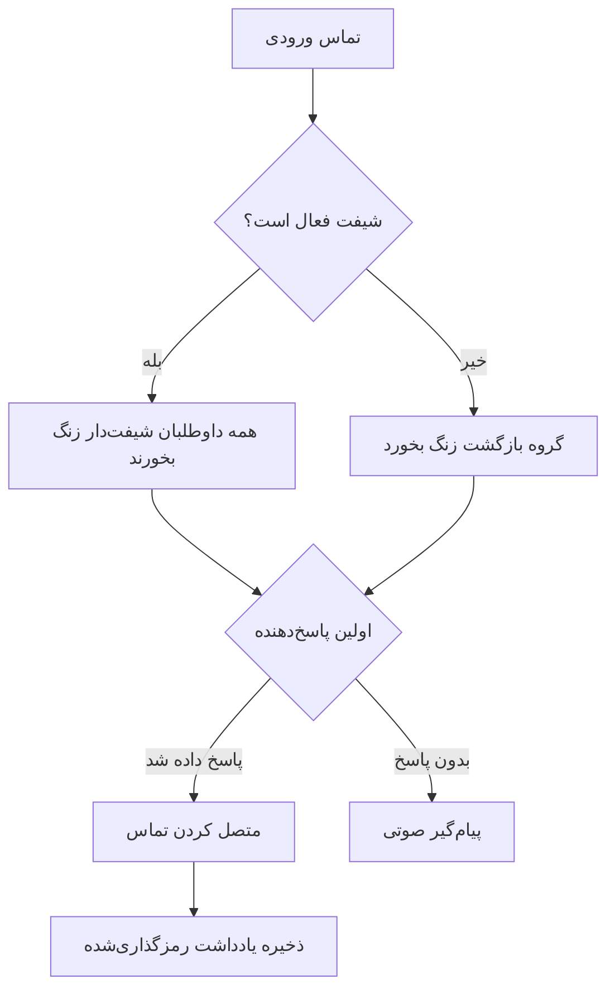

یک خط تلفن Llamenos را به صورت محلی یا روی سرور راه‌اندازی کنید. فقط Docker نیاز است — نیازی به Node.js، Bun یا runtimeهای دیگر نیست.

## نحوه کار

وقتی کسی با شماره خط تلفن شما تماس می‌گیرد، Llamenos تماس را به طور همزمان به همه داوطلبان شیفت‌دار هدایت می‌کند. اولین داوطلبی که پاسخ دهد، متصل می‌شود و بقیه زنگ‌شان قطع می‌شود. پس از پایان تماس، داوطلب می‌تواند یادداشت‌های رمزگذاری‌شده درباره مکالمه ذخیره کند.



همین مسیریابی برای پیام‌های پیامک، واتس‌اپ و سیگنال اعمال می‌شود — آن‌ها در یک نمای **Conversations** واحد ظاهر می‌شوند که داوطلبان می‌توانند در آن پاسخ دهند.

## پیش‌نیازها

- [Docker](https://docs.docker.com/get-docker/) با Docker Compose v2
- `openssl` (در اکثر سیستم‌های Linux و macOS از پیش نصب شده است)
- Git

## شروع سریع

```bash
git clone https://github.com/rhonda-rodododo/llamenos.git
cd llamenos
./scripts/docker-setup.sh
```

این کار همه رازهای مورد نیاز را تولید، برنامه را build و سرویس‌ها را راه‌اندازی می‌کند. پس از تکمیل، **http://localhost:8000** را باز کنید و ویزارد راه‌اندازی شما را در این مراحل راهنمایی می‌کند:

1. **ایجاد حساب مدیر** — یک keypair رمزنگاری در مرورگر شما تولید می‌کند
2. **نام‌گذاری خط تلفن** — تنظیم نام نمایشی
3. **انتخاب کانال‌ها** — صدا، پیامک، واتس‌اپ، سیگنال و/یا گزارش‌ها را فعال کنید
4. **پیکربندی ارائه‌دهندگان** — اعتبارنامه هر کانال فعال را وارد کنید
5. **بررسی و پایان**

### امتحان حالت نمایشی

برای کاوش با داده‌های نمونه از پیش بارگذاری‌شده و ورود یک‌کلیکی (بدون نیاز به ایجاد حساب):

```bash
./scripts/docker-setup.sh --demo
```

## استقرار تولید

برای یک سرور با دامنه واقعی و TLS خودکار:

```bash
./scripts/docker-setup.sh --domain hotline.yourorg.com --email admin@yourorg.com
```

Caddy به طور خودکار گواهی‌های Let's Encrypt TLS را تهیه می‌کند. مطمئن شوید پورت‌های ۸۰ و ۴۴۳ باز هستند. پرچم `--domain` overlay Docker Compose تولید را فعال می‌کند که TLS، چرخش log و محدودیت‌های منابع را اضافه می‌کند.

برای جزئیات کامل در مورد سخت‌افزاری سرور، پشتیبان‌گیری، نظارت و سرویس‌های اختیاری، [راهنمای استقرار Docker Compose](/docs/deploy-docker) را ببینید.

## پیکربندی webhookها

پس از استقرار، webhookهای ارائه‌دهنده تلفنی خود را به URL استقرار خود اشاره دهید:

| Webhook | URL |
|---------|-----|
| صدا (ورودی) | `https://your-domain/api/telephony/incoming` |
| صدا (وضعیت) | `https://your-domain/api/telephony/status` |
| پیامک | `https://your-domain/api/messaging/sms/webhook` |
| واتس‌اپ | `https://your-domain/api/messaging/whatsapp/webhook` |
| سیگنال | پل را برای هدایت به `https://your-domain/api/messaging/signal/webhook` پیکربندی کنید |

برای راه‌اندازی مخصوص هر ارائه‌دهنده: [Twilio](/docs/setup-twilio)، [SignalWire](/docs/setup-signalwire)، [Vonage](/docs/setup-vonage)، [Plivo](/docs/setup-plivo)، [Asterisk](/docs/setup-asterisk)، [پیامک](/docs/setup-sms)، [واتس‌اپ](/docs/setup-whatsapp)، [سیگنال](/docs/setup-signal).

## گام‌های بعدی

- [استقرار Docker Compose](/docs/deploy-docker) — راهنمای کامل استقرار تولید با پشتیبان‌گیری و نظارت
- [راهنمای مدیر](/docs/admin-guide) — افزودن داوطلب، ایجاد شیفت، پیکربندی کانال‌ها و تنظیمات
- [راهنمای داوطلب](/docs/volunteer-guide) — با داوطلبان خود به اشتراک بگذارید
- [راهنمای گزارش‌دهنده](/docs/reporter-guide) — نقش گزارش‌دهنده را برای ارسال گزارش‌های رمزگذاری‌شده راه‌اندازی کنید
- [ارائه‌دهندگان تلفنی](/docs/telephony-providers) — مقایسه ارائه‌دهندگان صوتی
- [مدل امنیتی](/security) — درک رمزگذاری و مدل تهدید
