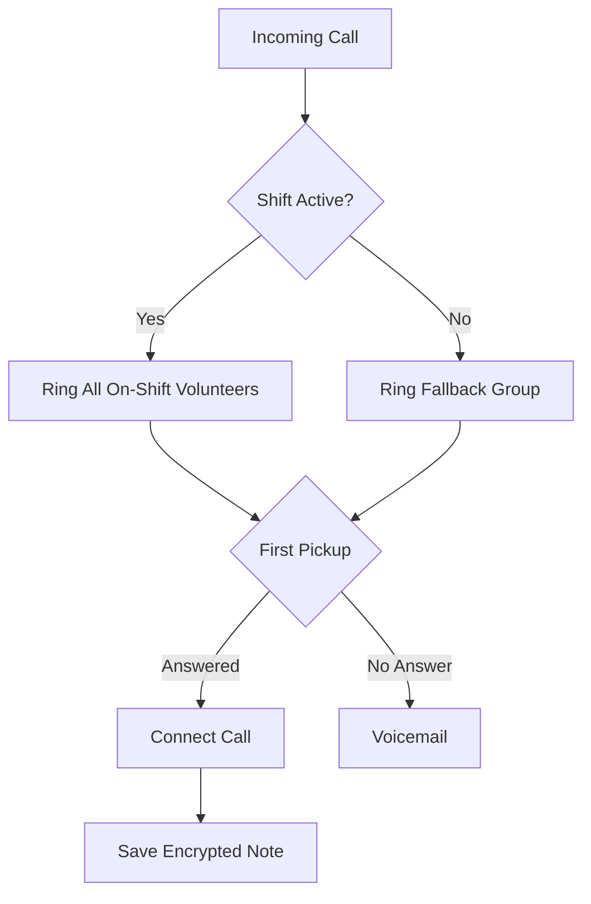

Ku soo saar hotline-kaaga Llamenos si guud ahaan ama server. Kaliya Docker baa loo baahan yahay — Node.js, Bun, ama runtime-yada kale ma loo baahan yahay.

## Sida uu u shaqeeyo

Marka qof uu waco lambarkaaga hotline-ka, Llamenos wuxuu waddooyiyaa wicitaanka dhammaan siiwacalayaasha shaqada jooga isla markiiba. Siiwacalaha ugu horreeya ee jawaaba wuxuu la xiriiraa, kuwa kalena way joooshaan. Kadib marka wicitaanku dhaco, siiwacaluhu wuxuu keyd karaa qoraal sirta ah ku saabsan wada-hadalka.



Isla waddooyinkaas waxay u dhacdaa fariimaha SMS, WhatsApp, iyo Signal — waxay u soo baxaan muuqaal la mid ah ee **Conversations** halkaas oo siiwacalayaalu jawaabi karaan.

## Shuruudaha hore

- [Docker](https://docs.docker.com/get-docker/) iyagoo leh Docker Compose v2
- `openssl` (rakibaan kasta oo Linux iyo macOS ah)
- Git

## Bilow degdegsan

```bash
git clone https://github.com/rhonda-rodododo/llamenos.git
cd llamenos
./scripts/docker-setup.sh
```

Tani waxay soo saartaa dhammaan sirta ee loo baahan yahay, dhisaysaa app-ka, oo bilaabaysaa adeegyada. Marka ay dhammaato, booqo **http://localhost:8000** oo setup wizard-ku wuxuu ku hoggaamin doonaa:

1. **Abuur koontadaada maamulka** — soo saar cryptographic keypair browser-kaaga
2. **Magacaab hotline-kaaga** — deji magaca muujinta
3. **Dooro islaahlabka** — fur Cod, SMS, WhatsApp, Signal, iyo/ama Reports
4. **Hagaaji bixiyeyaasha** — geli aqoonsiga islaahlab kasta oo furan
5. **Dib u eeg oo dhammeystir**

### Tijaabi demo mode

Si aad u baadho xogta tusaalaha iyo hal-guuri login (uma baahnid in aad abuurto koonto):

```bash
./scripts/docker-setup.sh --demo
```

## Production deployment

Server leh domain dhab ah iyo TLS otomaatig ah:

```bash
./scripts/docker-setup.sh --domain hotline.yourorg.com --email admin@yourorg.com
```

Caddy si otomaatig ah u soo saartaa shahaadooyinka Let's Encrypt TLS. Hubi in alaab-qaadaha 80 iyo 443 ay furan yihiin. Calaamadda `--domain` waxay kicisaa production Docker Compose overlay, taasoo ku dartay TLS, log rotation, iyo xadidaadaha kaydka.

Eeg [Docker Compose deployment guide](/docs/deploy-docker) si aad u hesho faahfaahin buuxda ku saabsan server hardening, backup-yada, baaritaanka, iyo adeegyada ikhtiyaarka ah.

## Hagaaji webhooks

Kadib deployment-ka, u jeedi webhooks-ka bixiyahaaga telefooniyada URL-kaaga deployment-ka:

| Webhook | URL |
|---------|-----|
| Cod (soo gala) | `https://your-domain/api/telephony/incoming` |
| Cod (xaaladda) | `https://your-domain/api/telephony/status` |
| SMS | `https://your-domain/api/messaging/sms/webhook` |
| WhatsApp | `https://your-domain/api/messaging/whatsapp/webhook` |
| Signal | Hagaaji bridge si uu u gudbiyo `https://your-domain/api/messaging/signal/webhook` |

Hageysiga ku saabsan bixiyaha kala duwan: [Twilio](/docs/setup-twilio), [SignalWire](/docs/setup-signalwire), [Vonage](/docs/setup-vonage), [Plivo](/docs/setup-plivo), [Asterisk](/docs/setup-asterisk), [SMS](/docs/setup-sms), [WhatsApp](/docs/setup-whatsapp), [Signal](/docs/setup-signal).

## Talaabooyinka xiga

- [Docker Compose Deployment](/docs/deploy-docker) — haggaag buuxa ee production deployment iyagoo leh backup-yo iyo baaritaan
- [Admin Guide](/docs/admin-guide) — ku dar siiwacalayaal, samee shaqooyin, hagaaji islaahlabka iyo goobaha
- [Volunteer Guide](/docs/volunteer-guide) — la wadaag siiwacalayaashaada
- [Reporter Guide](/docs/reporter-guide) — deji doorka reporter si aad u hesho soo gudbinta warbixinnada sirta ah
- [Telephony Providers](/docs/telephony-providers) — isbarbardhig bixiyeyaasha codka
- [Security Model](/security) — fahma sirta iyo threat model-ka
