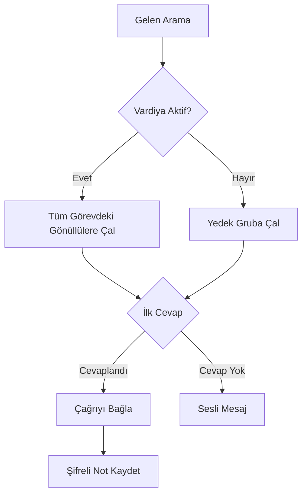

Llamenos yardım hattınızı yerel olarak veya bir sunucuda çalıştırın. Yalnızca Docker gerekli — Node.js, Bun veya başka çalışma zamanlarına ihtiyaç yok.

## Nasıl çalışır

Birisi yardım hattı numaranızı aradığında, Llamenos aramayı aynı anda tüm görevdeki gönüllülere yönlendirir. İlk cevap veren gönüllü bağlanır ve diğerlerinin çalması durur. Arama bittikten sonra gönüllü, konuşma hakkında şifreli notlar kaydedebilir.



Aynı yönlendirme SMS, WhatsApp ve Signal mesajları için de geçerlidir — bunlar, gönüllülerin yanıt verebileceği birleşik **Konuşmalar** görünümünde görünür.

## Ön koşullar

- [Docker](https://docs.docker.com/get-docker/) ve Docker Compose v2
- `openssl` (çoğu Linux ve macOS sisteminde önceden yüklü)
- Git

## Hızlı başlangıç

```bash
git clone https://github.com/rhonda-rodododo/llamenos.git
cd llamenos
./scripts/docker-setup.sh
```

Bu, gerekli tüm gizli anahtarları oluşturur, uygulamayı derler ve hizmetleri başlatır. Tamamlandığında **http://localhost:8000** adresini ziyaret edin ve kurulum sihirbazı sizi şu adımlarda yönlendirecektir:

1. **Yönetici hesabınızı oluşturun** — tarayıcınızda kriptografik bir anahtar çifti oluşturur
2. **Yardım hattınıza ad verin** — görünen adı ayarlayın
3. **Kanalları seçin** — Ses, SMS, WhatsApp, Signal ve/veya Raporları etkinleştirin
4. **Sağlayıcıları yapılandırın** — her etkin kanal için kimlik bilgilerini girin
5. **İncele ve bitir**

### Demo modunu deneyin

Önceden doldurulmuş örnek verilerle ve tek tıklamayla oturum açma (hesap oluşturmaya gerek yok) ile keşfetmek için:

```bash
./scripts/docker-setup.sh --demo
```

## Üretim dağıtımı

Gerçek bir alan adı ve otomatik TLS ile bir sunucu için:

```bash
./scripts/docker-setup.sh --domain hotline.yourorg.com --email admin@yourorg.com
```

Caddy, otomatik olarak Let's Encrypt TLS sertifikaları sağlar. 80 ve 443 numaralı bağlantı noktalarının açık olduğundan emin olun. `--domain` bayrağı, üretim Docker Compose katmanını etkinleştirir; bu TLS, günlük döndürme ve kaynak sınırları ekler.

Docker Compose dağıtım rehberinde sunucu sertleştirme, yedeklemeler, izleme ve isteğe bağlı hizmetler hakkında tüm detaylar için [Docker Compose dağıtım rehberi](/docs/deploy-docker) sayfasına bakın.

## Web kancalarını yapılandırın

Dağıtımdan sonra, telefon sağlayıcınızın web kancalarını dağıtım URL'nize yönlendirin:

| Web Kancası | URL |
|---------|-----|
| Ses (gelen) | `https://your-domain/api/telephony/incoming` |
| Ses (durum) | `https://your-domain/api/telephony/status` |
| SMS | `https://your-domain/api/messaging/sms/webhook` |
| WhatsApp | `https://your-domain/api/messaging/whatsapp/webhook` |
| Signal | Köprüyü `https://your-domain/api/messaging/signal/webhook` adresine iletecek şekilde yapılandırın |

Sağlayıcıya özel kurulum için: [Twilio](/docs/setup-twilio), [SignalWire](/docs/setup-signalwire), [Vonage](/docs/setup-vonage), [Plivo](/docs/setup-plivo), [Asterisk](/docs/setup-asterisk), [SMS](/docs/setup-sms), [WhatsApp](/docs/setup-whatsapp), [Signal](/docs/setup-signal).

## Sonraki adımlar

- [Docker Compose Dağıtımı](/docs/deploy-docker) — yedeklemeler ve izleme ile tam üretim dağıtım rehberi
- [Yönetici Kılavuzu](/docs/admin-guide) — gönüllü ekleme, vardiya oluşturma, kanal ve ayar yapılandırma
- [Gönüllü Kılavuzu](/docs/volunteer-guide) — gönüllülerinizle paylaşın
- [Raporlayıcı Kılavuzu](/docs/reporter-guide) — şifreli rapor gönderimleri için raporlayıcı rolünü ayarlayın
- [Telefon Sağlayıcıları](/docs/telephony-providers) — ses sağlayıcılarını karşılaştırın
- [Güvenlik Modeli](/security) — şifreleme ve tehdit modelini anlayın
