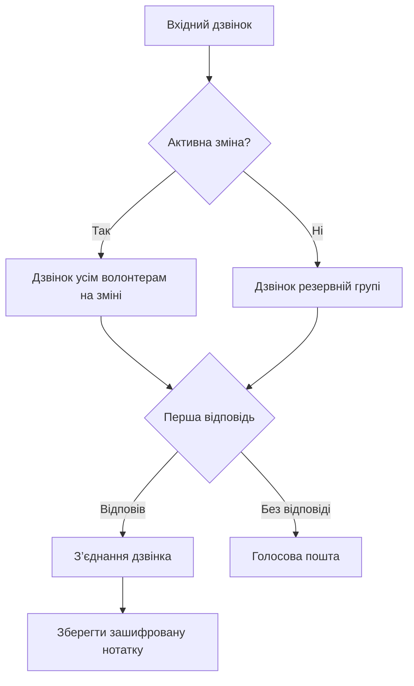

Запустіть гарячу лінію Llamenos локально або на сервері. Потрібен лише Docker — Node.js, Bun або інші середовища виконання не потрібні.

## Як це працює

Коли хтось телефонує на номер вашої гарячої лінії, Llamenos спрямовує дзвінок одночасно всім волонтерам, які перебувають на зміні. Перший волонтер, який відповідає, отримує з’єднання, а решта припиняють дзвонити. Після завершення дзвінка волонтер може зберегти зашифровані нотатки про розмову.



Так само працює маршрутизація SMS, WhatsApp і Signal повідомлень — вони з’являються в єдиному перегляді **Розмови**, де волонтери можуть відповідати.

## Передумови

- [Docker](https://docs.docker.com/get-docker/) з Docker Compose v2
- `openssl` (попередньо встановлено на більшості систем Linux і macOS)
- Git

## Швидкий старт

```bash
git clone https://github.com/rhonda-rodododo/llamenos.git
cd llamenos
./scripts/docker-setup.sh
```

Це генерує всі необхідні секрети, збирає застосунок і запускає сервіси. Після завершення відкрийте **http://localhost:8000**, і майстер налаштування проведе вас через:

1. **Створення облікового запису адміністратора** — генерує криптографічну пару ключів у вашому браузері
2. **Назва вашої гарячої лінії** — встановіть відображувану назву
3. **Вибір каналів** — увімкніть Голос, SMS, WhatsApp, Signal та/або Повідомлення
4. **Налаштування провайдерів** — введіть облікові дані для кожного ввімкненого каналу
5. **Перевірка та завершення**

### Спробуйте демо-режим

Щоб дослідити з попередньо заповненими зразками даних і входом в один клік (без створення облікового запису):

```bash
./scripts/docker-setup.sh --demo
```

## Розгортання у продакшені

Для сервера зі справжнім доменом і автоматичним TLS:

```bash
./scripts/docker-setup.sh --domain hotline.yourorg.com --email admin@yourorg.com
```

Caddy автоматично отримує сертифікати Let’s Encrypt TLS. Переконайтеся, що порти 80 і 443 відкриті. Прапорець `--domain` активує продакшн-оверлей Docker Compose, який додає TLS, ротацію журналів і обмеження ресурсів.

Дивіться [посібник з розгортання Docker Compose](/docs/deploy-docker) для повної інформації про посилення безпеки сервера, резервне копіювання, моніторинг та додаткові сервіси.

## Налаштуйте вебхуки

Після розгортання спрямуйте вебхуки вашого телефонного провайдера на URL вашого розгортання:

| Вебхук | URL |
|---------|-----|
| Голос (вхідний) | `https://your-domain/api/telephony/incoming` |
| Голос (статус) | `https://your-domain/api/telephony/status` |
| SMS | `https://your-domain/api/messaging/sms/webhook` |
| WhatsApp | `https://your-domain/api/messaging/whatsapp/webhook` |
| Signal | Налаштуйте міст для пересилання на `https://your-domain/api/messaging/signal/webhook` |

Для налаштування конкретного провайдера: [Twilio](/docs/setup-twilio), [SignalWire](/docs/setup-signalwire), [Vonage](/docs/setup-vonage), [Plivo](/docs/setup-plivo), [Asterisk](/docs/setup-asterisk), [SMS](/docs/setup-sms), [WhatsApp](/docs/setup-whatsapp), [Signal](/docs/setup-signal).

## Наступні кроки

- [Розгортання Docker Compose](/docs/deploy-docker) — повний посібник з продакшн-розгортання з резервним копіюванням і моніторингом
- [Посібник адміністратора](/docs/admin-guide) — додавання волонтерів, створення змін, налаштування каналів і параметрів
- [Посібник волонтера](/docs/volunteer-guide) — поділіться зі своїми волонтерами
- [Посібник репортера](/docs/reporter-guide) — налаштуйте роль репортера для зашифрованих подань
- [Телефонні провайдери](/docs/telephony-providers) — порівняйте голосових провайдерів
- [Модель безпеки](/security) — зрозумійте шифрування та модель загроз
